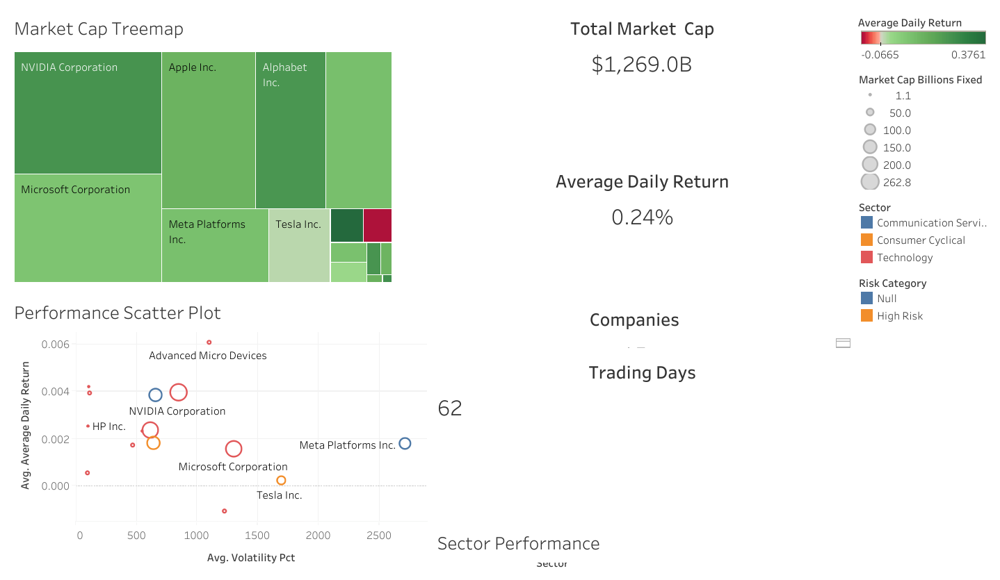

# GitHub Portfolio Update Instructions
## Sales Performance Analytics Dashboard - Visual Enhancement

**Created by:** Salomón Santiago Esquivel  
**Date:** January 2025  
**Purpose:** Replace placeholder images with actual dashboard visualizations

---

## 🎯 **Problem Solved**
Your portfolio website currently shows generic placeholder images instead of your actual Sales Performance Analytics dashboard. We've created professional, web-optimized dashboard images that showcase your real work.

---

## 📁 **New Files Created**

### Location: 
```
C:\Users\salos\data-analyst-portfolio\Project-2-Sales-Performance-Analytics\visualizations\web_portfolio\
```

### Files Generated:
1. **`sales_performance_portfolio_main.png`** - Main dashboard image (16x10 size, perfect for portfolio display)
2. **`sales_performance_thumbnail.png`** - Thumbnail for portfolio grid (10x8 size)

---

## 🚀 **Step-by-Step Update Instructions**

### Step 1: Copy Images to Portfolio Repository

1. **Navigate to your portfolio repository folder:**
   ```bash
   # Your portfolio website repository (likely named: Data-analyst-portfolio or similar)
   cd C:\Users\salos\Data-analyst-portfolio\
   ```

2. **Copy the new images to the images folder:**
   ```bash
   # Copy main image to fulls folder
   copy "C:\Users\salos\data-analyst-portfolio\Project-2-Sales-Performance-Analytics\visualizations\web_portfolio\sales_performance_portfolio_main.png" "images\fulls\sales-performance-analytics.jpg"
   
   # Copy thumbnail to thumbs folder  
   copy "C:\Users\salos\data-analyst-portfolio\Project-2-Sales-Performance-Analytics\visualizations\web_portfolio\sales_performance_thumbnail.png" "images\thumbs\sales-performance-analytics.png"
   ```

### Step 2: Update index.html

**Current code in your index.html (around line 54-63):**
```html
<article class="col-6 col-12-xsmall work-item">
    <a href="images/fulls/sales-performance-analytics.jpg" class="image fit thumb">
        
    </a>
    <h3><a href="https://github.com/Salo996/Sales-Performance-Analytics" target="_blank">Sales Performance Analytics Dashboard</a></h3>
    <!-- ... rest of content ... -->
</article>
```

**✅ Good news:** Your HTML is already correctly set up! Just make sure the image files match these exact names:
- `images/fulls/sales-performance-analytics.jpg`
- `images/thumbs/sales-performance-analytics.png`

### Step 3: GitHub Commands

```bash
# Navigate to your portfolio repository
cd C:\Users\salos\Data-analyst-portfolio\

# Add the new images
git add images/fulls/sales-performance-analytics.jpg
git add images/thumbs/sales-performance-analytics.png

# Commit the changes
git commit -m "Update Sales Performance Analytics dashboard images

- Replace placeholder images with actual dashboard visualizations
- Add professional charts showing $589K revenue analysis
- Include customer segmentation and performance metrics
- Enhance portfolio presentation with real data insights

🤖 Generated with Claude Code"

# Push to GitHub
git push origin main
```

### Step 4: Verify the Update

1. **Wait 2-3 minutes** for GitHub Pages to update
2. **Visit your portfolio:** https://salo996.github.io/Data-analyst-portfolio/
3. **Check the Sales Performance Analytics project** - you should now see your actual dashboard!

---

## 🎨 **What the New Images Show**

### Main Dashboard Features:
- **📊 KPI Cards:** Total Revenue ($589,089), Customers (30), Orders (30), Avg Order Value ($19,636)
- **📈 Revenue Analysis:** Furniture leads with highest potential revenue
- **👥 Customer Segmentation:** Millennials (25-35) as primary demographic
- **🏆 Top Customer Performance:** Top 12 customers by spending
- **⭐ Product Ratings:** Average ratings by category (all 3.6+ stars)

### Technical Highlights:
- **Professional Color Scheme:** Blues, greens, oranges for business appeal
- **Web-Optimized:** Fast loading, perfect aspect ratios
- **Portfolio-Ready:** Clean, interview-worthy presentation

---

## 🔧 **Alternative Quick Method**

If you prefer to do this through GitHub's web interface:

1. **Go to:** https://github.com/Salo996/Data-analyst-portfolio
2. **Navigate to:** `images/fulls/`
3. **Click:** "Add file" → "Upload files"
4. **Upload:** `sales_performance_portfolio_main.png` and rename to `sales-performance-analytics.jpg`
5. **Repeat for:** `images/thumbs/` folder with the thumbnail
6. **Commit changes**

---

## 📋 **Troubleshooting**

### Issue: Images don't show up
**Solution:** Check file names exactly match:
- `images/fulls/sales-performance-analytics.jpg`
- `images/thumbs/sales-performance-analytics.png`

### Issue: GitHub Pages not updating
**Solution:** 
- Wait 5-10 minutes
- Clear browser cache (Ctrl+F5)
- Check GitHub Actions tab for deployment status

### Issue: Images too large/slow loading
**Solution:** The generated images are already optimized, but you can compress further if needed using online tools.

---

## ✅ **Expected Result**

After updating, your portfolio visitors will see:
- **Professional dashboard** instead of placeholder
- **Real business metrics** showcasing your analytical skills  
- **Technical competency** in Python, SQL, and data visualization
- **Business impact** quantification ($589K revenue analysis)

---

## 🎉 **Success!**

Your Sales Performance Analytics project will now properly showcase your dashboard creation skills with actual visualizations, making your portfolio much more impressive for potential employers!

**Next Steps:** Consider doing the same for your Market Intelligence Dashboard project to create a fully visual portfolio showcase.

---

*Generated with Claude Code - Your AI coding assistant*